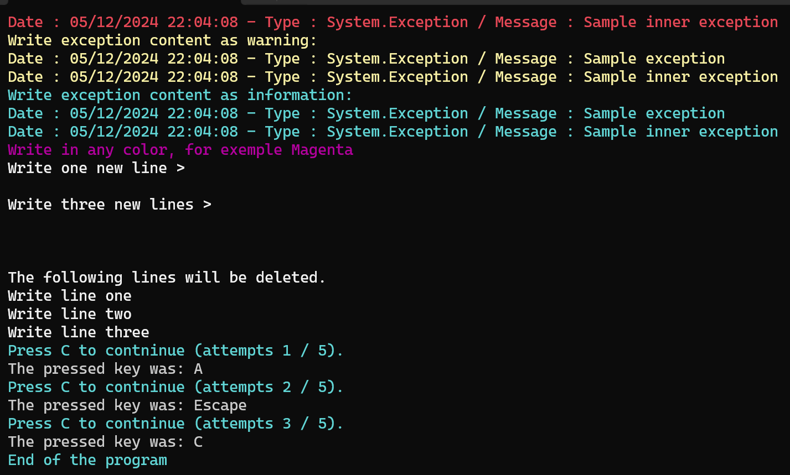

# ConsoleLogMagnifier

Magnify your log in your Console App, in .NET.

[](https://www.nuget.org/packages/Puffix.ConsoleLogMagnifier/)
[](https://github.com/EhRom/Puffix.ConsoleLogMagnifier/actions?query=workflow%3A%22.NET+Core%22)

Code sample:
``` csharp
using Puffix.ConsoleLogMagnifier;

// Standard behavior
ConsoleHelper.Write("Write text in white");
ConsoleHelper.WriteSuccess("Write text in green");
ConsoleHelper.WriteVerbose("Write text in gray");
ConsoleHelper.WriteInfo("Write information. The text is in cyan.");
ConsoleHelper.WriteWarning("Write warning. The text is in yellow.");
ConsoleHelper.WriteError("Write error. The text is in red.");

// Display exceptions content
Exception exception = new Exception("Sample exception", new Exception("Sample inner exception"));
try
{
    throw exception;
}
catch (Exception error)
{
    ConsoleHelper.WriteError("Write exception content as error:", error);
}

try
{
    throw exception;
}
catch (Exception error)
{
    ConsoleHelper.WriteWarning("Write exception content as warning:", error);
}

try
{
    throw exception;
}
catch (Exception error)
{
    ConsoleHelper.WriteInfo("Write exception content as information:", error);
}

// Custom color
ConsoleHelper.Write(ConsoleColor.Magenta, "Write in any color, for exemple Magenta");

// Empty new lines
ConsoleHelper.Write("Write one new line >");
ConsoleHelper.WriteNewLine();

ConsoleHelper.Write("Write three new lines >");
ConsoleHelper.WriteNewLine(3);

// Clear last lines or characters
ConsoleHelper.Write("The following lines will be deleted.");
ConsoleHelper.Write("Write line one");
ConsoleHelper.Write("Write line two");
ConsoleHelper.Write("Write line thre");

await Task.Delay(1000);
ConsoleHelper.ClearLastLines();
ConsoleHelper.Write("Write line three");

ConsoleKey key;

int attempts = 0;
const int MAX_ATTEMPTS = 5;
do
{
    ConsoleHelper.WriteInfo($"Press C to contninue (attempts {++attempts} / {MAX_ATTEMPTS}).");
    key = ConsoleHelper.ReadKey();

    ConsoleHelper.WriteVerbose($"The pressed key was: {key}");

} while (key != ConsoleKey.C && attempts < MAX_ATTEMPTS);


ConsoleHelper.WriteInfo("Enter a text line.");
string text = ConsoleHelper.ReadLine();

ConsoleHelper.WriteVerbose($"The entered text was: {text}");


ConsoleHelper.WriteVerbose("Press any key when you are ready.");
ConsoleHelper.ReadKey();

ConsoleHelper.ClearLastLines(3);

ConsoleHelper.WriteInfo("End of the program");
```

Result:

